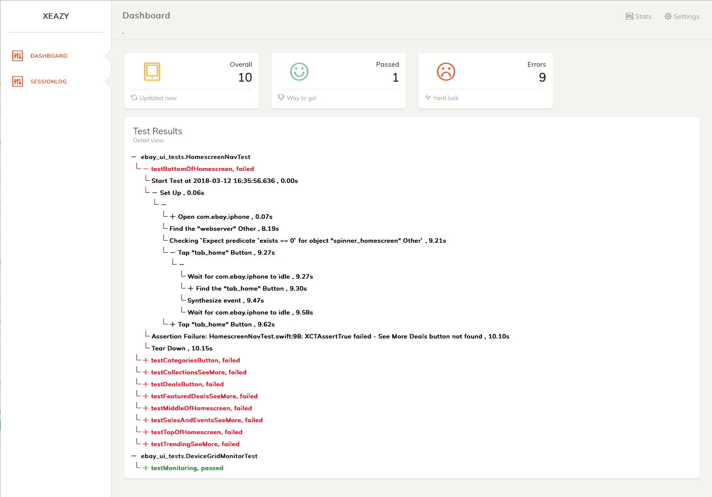

# xeazy
Xeazy is a HTML Report Generator for xctest designed to be piped with 'xcodebuild' command line tool to produce customized HTML page.


## Download
[](src/dist)

## Usage
``` bash
$ xcodebuild [flags] | xeazy -r html -o ./
```

## Example Usage
``` bash
$ xcodebuild test-without-building  
             -xctestrun Products/ebay-ui-tests_iphonesimulator11.2-x86_64.xctestrun 
             -destination 'platform=iOS Simulator,name=iPhone 8 Plus,OS=11.2' 
             -only-testing:ebay-ui-tests/DeviceGridMonitorTest 
             | ./xeazy -r html -o ./
```

## Output
xeazy will produce the xeazy-output folder which contains dashboard.html <br>

Summary of the Test Suites

 <br>

Detailed reports with steps




## LICENSE
 
Copyright 2018 eBay Inc. <br>
Developer : Karunamoorthy,Elango <br>
Architect : Gopalakrishnan Karunakaran,Jegan <br>
 
Use of this source code is governed by an MIT-style
license that can be found in the LICENSE file or at
https://opensource.org/licenses/MIT.
